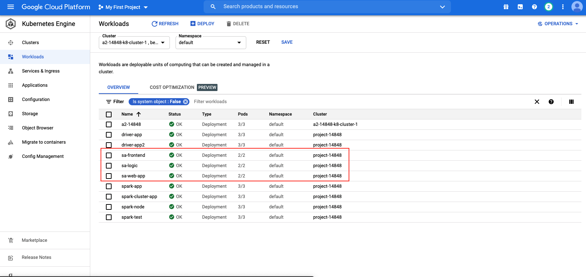
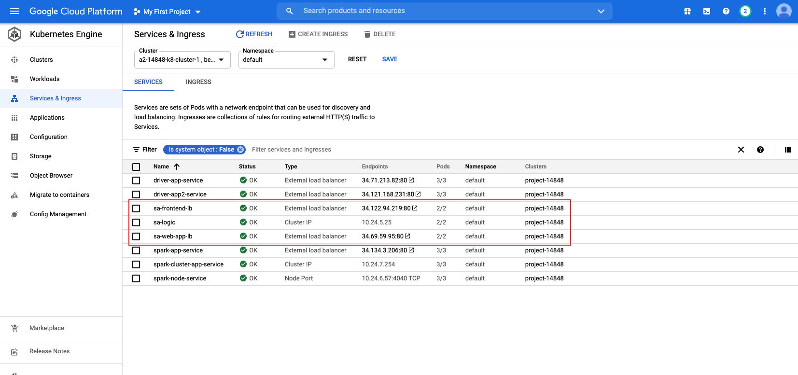

# 14848_Cloud_Infra_Sentiment-Analysis

## Docker image preparation

### sa-frontend preparation
    1. Prepare NodeJS and NPM first. Please go to NodeJS official webside and install NodeJS and NPM: https://nodejs.org/en/download/
    2. Go to sa-frontend folder and execute command.sh: `cd sa-frontend && command.sh`
    3. After executing command.sh, build folder will be generated.
    4. export DOCKER_USER_ID=<Your docker user ID>
    5. Build docker image: 
        ```
        docker build -f Dockerfile -t $DOCKER_USER_ID/sentiment-analysis-frontend .
        ```
    6. Push $DOCKER_USER_ID/sentiment-analysis-frontend to docker hub: 
        ```
        docker push $DOCKER_USER_ID/sentiment-analysis-frontend
        ```

### sa-webapp preparation
    1. Install JDK8 first. Please download the version 8u212-b10 from `https://github.com/frekele/oracle-java/releases`
    2. Packaging the Application into a Jar:
        ```
        cd sa-webapp
        mvn install
        ```
    3. Build docker image:
        ```
        docker build -f Dockerfile -t $DOCKER_USER_ID/sentiment-analysis-web-app .
        ```
    4. Push $DOCKER_USER_ID/sentiment-analysis-web-app to docker hub: 
        ```
        docker push $DOCKER_USER_ID/sentiment-analysis-web-app
        ```

### sa-logic preparation
    1. Install Python3 first.
    2. Go to sa-logic folder and install dependancies: 
        ```
        cd sa-logic
        python3 -m pip install -r requirements.txt
        python3 -m textblob.download_corpora
        ```
    3. Build docker image:
        ```
        docker build -f Dockerfile -t $DOCKER_USER_ID/sentiment-analysis-logic .
        ```
    4. Push $DOCKER_USER_ID/sentiment-analysis-logic to docker hub: 
        ```
        docker push $DOCKER_USER_ID/sentiment-analysis-logic
        ```

## Google Kubernetes

### Create GKE Cluster
    -

### Create GKE development
    1. Go to GCP and open Cloud Shell
    2. git clone https://github.com/shihsunl/14848_Cloud_Infra_Sentiment-Analysis.git
    3. Create sa-frontend deployment
        ```
        cd 14848_Cloud_Infra_Sentiment-Analysis/Sentiment-Analysis/resource-manifests
        kubectl apply -f sa-frontend-deployment.yaml
        ```
    4. Create sa-webapp deployment
        ```
        kubectl apply -f sa-web-app-deployment.yaml
        ```
    5. Create sa-logic deployment
        ```
        kubectl apply -f sa-logic-deployment.yaml
        ```
    6. Check Deployment
    

### Create GKE Load Balancer and Service
    1. Create sa-frontend load balancer
        ```
        cd 14848_Cloud_Infra_Sentiment-Analysis/Sentiment-Analysis/resource-manifests
        kubectl create -f service-sa-frontend-lb.yaml
        ```
    2. Create sa-webapp load balancer
        ```
        kubectl create -f service-sa-frontend-lb.yaml
        ```
    3. Create sa-logic service
        ```
        kubectl create -f service-sa-frontend-lb.yaml
        ```
    4. Check Load Balancer and Service
    

